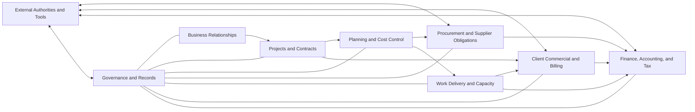

# Domain Map

## Overview

**Status:** Proposed conversation map for the initial client review. These areas
are business-language boundaries, not software services, menus, or databases.

## Proposed business areas

### Business Relationships

Explains stable identity and the dated roles or responsibilities through which
people and organizations participate. Candidate concepts include Party, Person,
Organization, Identifier, Contact Point, Business Role, and Party Relationship.

### Projects and Contracts

Explains what constitutes one project, where it happens, who participates, what
authorizes it, and how its lifecycle and contractual scope are preserved.

### Planning and Cost Control

Explains intended scope, quantities, resources, unit-price assumptions, budgets,
schedules, progress, baselines, forecasts, and controlled changes.

### Procurement and Supplier Obligations

Explains how goods and services are requested, sourced, received, evidenced,
invoiced, allocated to cost, and recognized as obligations.

### Work Delivery and Capacity

Explains contractor and workforce participation, assignments, measured work,
`cubicaciones`, operational payroll inputs, approvals, and actual delivery.

### Client Commercial and Billing

Explains client relationships, accepted commercial terms, change approvals,
progress certification, invoicing, receipts, and outstanding balances.

### Finance, Accounting, and Tax

Explains obligations, money movement, payment allocation, reconciliation,
accounting consequences, tax reporting, controls, and closing.

### Governance and Records

Explains documents, evidence, approval, decision authority, exceptions,
corrections, access responsibility, retention, and audit history across all
areas.

## Cross-domain distinctions to test

- A party is not the same thing as a supplier, contractor, worker, client, or
  system user; those are roles or relationships.
- A project, contract, site, cost center, and raw source label may be related but
  are not assumed to be synonyms.
- A budgeted amount, committed cost, incurred obligation, payment, and accounting
  posting answer different questions.
- Contractor work measurement, client progress certification, and payroll
  support may all be called `cubicacion` but require separate meanings.
- An invoice or claim establishes an obligation; a payment records money
  movement; an allocation explains what the payment settles.
- A source document, extracted value, approved business record, and report are
  different levels of authority.

## Initial review request

Ask the client to:

1. rename or correct any area that does not match how the company speaks;
2. identify an important area that is missing;
3. name the person who best explains each area; and
4. choose one real end-to-end workflow for the first detailed walkthrough.
