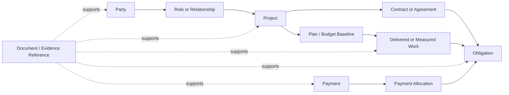

# Conceptual Relationships

This model shows business meaning and cardinality. It is not a database schema; technical models may
represent these relationships differently while preserving their meaning.

## Proposed relationship spine

This diagram is a review aid, not an accepted cardinality model. It proposes a
small spine that can connect the first workflows without merging their records.

## Relationships to establish through examples

- party to business role and effective period;
- client, owner, contact, and responsible party to project and contract;
- project to site, phase, cost center, budget baseline, and change;
- supplier or contractor to quote, agreement, purchase, delivered work, invoice,
  or claim;
- worker to engagement, crew, project assignment, attendance/work evidence, and
  payroll obligation;
- project delivery to contractor claim and client progress certification;
- obligation to its business cause and responsible party;
- payment to payer/payee, bank or cash evidence, and allocations;
- source document to extracted value, reviewed record, approval, correction, and
  report.

## Modeling rule

When a fact changes over time, prefer a dated relationship or controlled record
over silently replacing an attribute on a master entity. Confirm the business
need first; do not create technical history merely for theoretical completeness.
